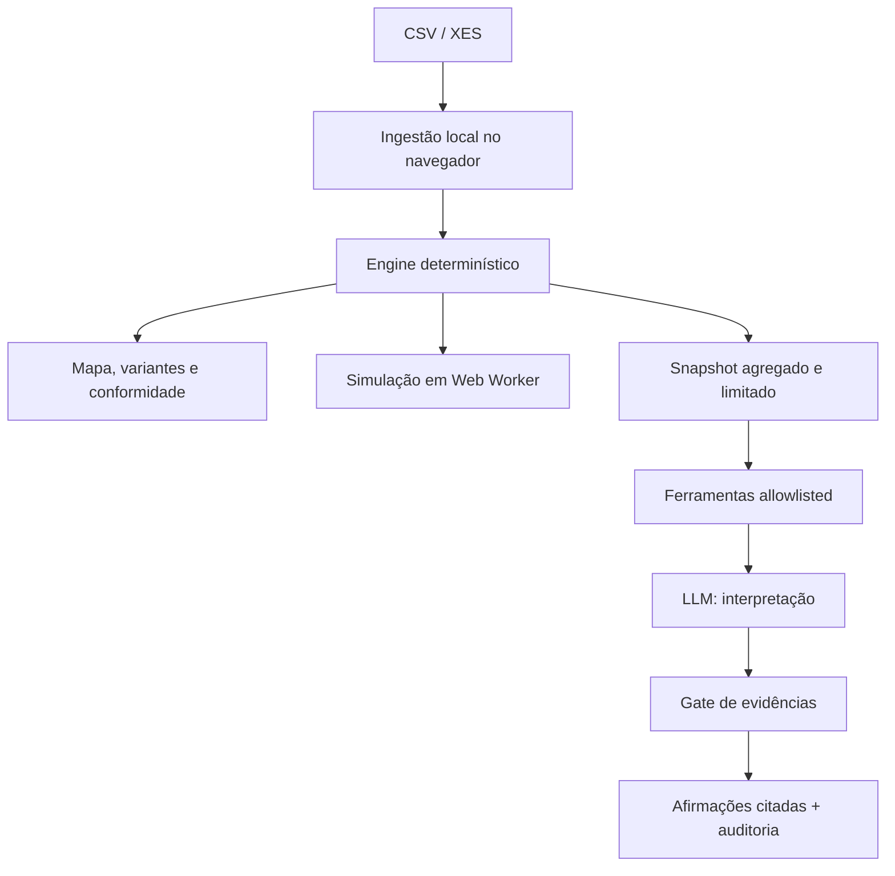

# ProcessGraph AI

> **Seu processo de compra leva 14 dias. Você acha que sabe por quê. Os dados dizem outra coisa.**

ProcessGraph AI transforma logs de eventos em um mapa auditável do processo real: descobre caminhos, mede desvios, ranqueia gargalos por distribuição e testa cenários operacionais em uma simulação reprodutível. A IA não calcula métricas nem consulta o banco livremente — ela investiga fatos já calculados por meio de ferramentas tipadas e cada afirmação precisa apontar para uma evidência válida.

O projeto combina **process mining**, **conformance checking**, **simulação de eventos discretos** e **investigação assistida por LLM** em uma aplicação full-stack responsiva, com limites metodológicos explícitos.

## Por que este projeto existe

ERPs registram aprovações, pedidos, recebimentos e pagamentos. Eles raramente mostram o processo de ponta a ponta — especialmente quando o fluxo atravessa filiais, e-mail e sistemas que não conversam. O ProcessGraph AI responde a quatro perguntas sem terceirizar a matemática para o modelo:

1. Qual fluxo realmente aconteceu?
2. Onde os casos esperaram e quais variantes ampliaram o lead time?
3. O log está em conformidade com o modelo descoberto?
4. O que pode acontecer sob mudança de volume, capacidade, política ou automação?

## O que está operacional

| Capacidade   | Implementação                                                                                | Garantia exibida                                                              |
| ------------ | -------------------------------------------------------------------------------------------- | ----------------------------------------------------------------------------- |
| Ingestão     | CSV e subconjunto conservador de XES; aliases PT/EN; atributos livres                        | relatório de qualidade, hash da fonte e linhas rejeitadas                     |
| Descoberta   | DFG + árvore de processo recursiva com cortes de sequência, XOR, paralelismo e loop          | fallback contabilizado; nunca apresentado como descoberta perfeita            |
| Conformidade | split determinístico treino/holdout + alinhamento de sequência com movimentos sync/log/model | fitness, precision e generalization vinculados ao holdout                     |
| Gargalos     | tempo por atividade e transição                                                              | mínimo, quartis, mediana, P90, P95, máximo e desvio-padrão                    |
| Variantes    | agrupamento por caminho exato                                                                | ranking por frequência e impacto no lead time                                 |
| Investigação | três ferramentas allowlisted, schemas estritos, até três chamadas e trilha de auditoria      | IDs inválidos, números inventados e ferramentas fora do escopo são rejeitados |
| DecisionOps  | filas por atividade, chegadas de Poisson, capacidades por recurso e distribuições ajustadas  | seed fixa, intervalo empírico entre replicações e gate de validação histórica |

## Arquitetura de confiança



O arquivo bruto permanece no navegador. A investigação envia somente um snapshot agregado e limitado. Isso reduz exposição, mas não prova criptograficamente que o snapshot foi calculado a partir de um log íntegro; o [modelo de ameaças](docs/threat-model.md) registra esse risco residual.

## Execução local

Requisitos: Node.js 20 ou 22 e pnpm 10.4.1 via Corepack.

```bash
corepack enable
pnpm install --frozen-lockfile
cp .env.example .env
pnpm dev
```

Abra `http://localhost:3000`. O dashboard inicia com um log sintético determinístico e funciona sem banco ou chave de IA. Os registros demo são **dados artificiais**, não observações de uma empresa real.

Para persistência e autenticação, suba o PostgreSQL e aplique a migração:

```bash
docker compose up -d postgres
pnpm db:migrate
```

A investigação com IA exige autenticação configurada e um endpoint compatível com OpenAI:

```dotenv
LLM_BASE_URL=https://api.openai.com/v1
LLM_API_KEY=...
LLM_MODEL=gpt-4.1-mini
```

Nenhuma chave é enviada ao cliente. Sem essas variáveis, descoberta, conformidade, variantes e simulação continuam disponíveis; apenas a investigação narrativa fica indisponível.

Para avaliar a investigação localmente sem configurar um provedor OAuth, use `DEMO_USER_ENABLED=true` em desenvolvimento. Esse bypass é ignorado quando `NODE_ENV=production` e não deve ser tratado como autenticação real.

## Contrato de entrada

O CSV precisa conter `case_id`, `activity` e `timestamp`; `resource` é opcional. O parser reconhece aliases comuns em português e inglês, separadores por vírgula ou ponto e vírgula, campos entre aspas e BOM UTF-8. O importador XES suporta os atributos comuns `concept:name`, `time:timestamp` e `org:resource`, rejeita DTD/entidades e aplica limite de tamanho.

```csv
case_id,activity,timestamp,resource
PO-001,Solicitação criada,2026-01-05T08:00:00Z,Compras
PO-001,Aprovação gerencial,2026-01-06T10:30:00Z,Gestor
PO-001,Pedido emitido,2026-01-06T14:10:00Z,ERP
```

O relatório de qualidade expõe timestamps inválidos, campos obrigatórios ausentes, duplicatas, eventos fora de ordem, casos unitários e recursos ausentes. Casos filtrados preservam o trace completo para evitar cortar o fluxo no meio.

## Metodologia sem marketing enganoso

- A árvore de processo usa cortes inspirados no Inductive Miner, mas o repositório **não afirma equivalência** a uma implementação acadêmica completa. Fallbacks ficam visíveis.
- Métricas de conformidade são do alinhamento de sequências deste engine, não token replay de uma Petri net.
- Com apenas timestamps de conclusão, o intervalo entre eventos mistura fila, trabalho e etapas não registradas. Ele é um proxy, não tempo de serviço observado.
- Ajuste de distribuição compara candidatos exponencial e log-normal por BIC e publica o diagnóstico KS; isso não elimina incerteza estrutural.
- O intervalo reportado é a faixa empírica central de 95% entre medianas das replicações, não um intervalo causal.
- Se a simulação baseline não reproduzir o período histórico dentro da tolerância configurada, o resultado continua visível como diagnóstico, mas é marcado como **não apto para decisão**.
- O gate da IA garante estrutura, procedência dos IDs e ausência de números redigidos pelo modelo. Ele não prova que a prosa implica causalidade; hipóteses exigem revisão humana.

Leia a especificação completa em [metodologia](docs/methodology.md).

## Qualidade verificável

```bash
pnpm qa
```

O comando único bloqueia a release se qualquer etapa falhar:

- formatação determinística;
- TypeScript sem erros;
- suíte de testes com cobertura mínima de 85% para linhas, statements e funções e 75% para branches;
- build cliente/servidor;
- geração dupla e comparação byte a byte do artefato de prova;
- auditoria de dependências de produção em nível high/critical.

No estado versionado desta release, a suíte executa **44 testes em 9 arquivos** e alcança **93,68% de statements/linhas, 91,54% de funções e 79,13% de branches**. Esses números são resultado de `pnpm test:coverage`; a CI recalcula tudo em Node 20 e 22, em vez de confiar no texto deste README.

Os cenários cobrem recuperação estrutural em log conhecido, desvio plantado, gargalo plantado, determinismo com seed, validação histórica, entrada inválida nas ferramentas, tentativa de sair do escopo, citação fabricada e números inventados. Consulte os [gates de release](docs/release-gates.md).

## Organização do repositório

```text
client/                       dashboard React e Web Worker
shared/process-graph/         ingestão, estatística, descoberta e simulação
server/processGraph.*         ferramentas, investigação e gate de evidências
drizzle/                      schema e migração PostgreSQL
docs/                         arquitetura, metodologia, segurança e release gates
scripts/generate-proof.ts     artefato sintético reprodutível
```

O PostgreSQL modela propriedade de logs, eventos, execuções e passos de investigação; uma materialized view agrega as arestas do processo. O modo atual mantém a análise interativa no navegador e deixa a persistência preparada para uma implantação server-verified.

## Estado e roadmap

Esta é uma **release de engenharia para demonstração técnica**, não um sistema certificado para decisão financeira ou operação crítica.

- Fase 1: ingestão, descoberta, conformidade, variantes, gargalos e investigação restrita — implementada.
- Fase 2: simulação calibrada, cenários, intervalos e validação histórica — implementada em modo experimental.
- Próximos gates: benchmark contra implementação de referência, calendários de turno, tempos start/complete, avaliação humana de hipóteses, conectores ERP e teste de carga com logs de cliente anonimizados.

Contribuições devem preservar os limites de claim e passar por `pnpm qa`. Veja [CONTRIBUTING.md](CONTRIBUTING.md) e [SECURITY.md](SECURITY.md).

## Licença

MIT. Veja [LICENSE](LICENSE).
